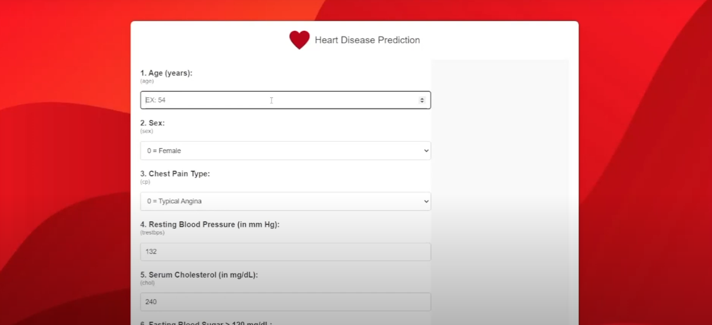

# 🫀 Heart Disease Prediction Using Machine Learning

This project uses machine learning techniques to predict the likelihood of heart disease based on clinical data. It explores and compares three classification algorithms—**Logistic Regression**, **Bagged Decision Trees**, and **Random Forest**—to determine which model offers the most accurate diagnosis.

This project also features a web app for user-friendly predictions using the best-performing model.

---

## 📌 Project Highlights

- **Dataset:** Modified from [Kaggle’s Heart Disease Dataset](https://www.kaggle.com/datasets) using recommendations from [this paper](https://libres.uncg.edu/ir/ecsu/f/Brandon_Simmons_Thesis-Final.pdf)
- **Best Model:** Bagged Decision Tree  
- **Highest Accuracy:** 98.54%  
- **Web App:** Flask-based interface for live predictions  

---

## 📂 Directory Structure

```
HEART-DISEASE-PREDICTION-ML/
├── Exploratory Data Analysis/
│   ├── EDA.ipynb                # Data visualization and statistics
│   ├── heart.csv                # Cleaned dataset
│   ├── models.py                # Model training scripts
│   ├── *.pkl                    # Trained model + scaler
├── flask/
│   ├── app.py                   # Flask web app
│   ├── templates/               # Jinja2 HTML templates
│   └── static/                  # CSS / JS files
├── Incorrect Results/           # Early plots from incorrect modeling
├── researchpaper.pdf            # Full academic paper
└── README.md
```

---

## 📊 Model Performance Summary

| Model                                | Accuracy | Precision | Recall | F1 Score |
|-------------------------------------|----------|-----------|--------|----------|
| Logistic Regression                 | 77.56%   | 79.79%    | 73.53% | 76.53%   |
| Bagged Decision Tree                | 98.54%   | 97.14%    | 100.0% | 98.55%   |
| Random Forest                       | 98.54%   | 97.14%    | 100.0% | 98.55%   |
| Logistic Regression (Selected)      | 76.59%   | 79.35%    | 71.57% | 75.26%   |
| Bagged Decision Tree (Selected)     | 97.07%   | 97.06%    | 97.06% | 97.06%   |
| Random Forest (Selected)            | 98.54%   | 97.14%    | 100.0% | 98.55%   |

---

## 🖼️ Visualizations

Here are some visuals used in the analysis:


### 🔍 Web App Demo



---

## 🧠 Key Insights

- Outliers in **cholesterol** and **max heart rate** significantly impacted model performance.
- Feature selection didn't significantly improve results due to the dataset's simplicity.
- Ensemble methods (Bagged Tree, Random Forest) vastly outperformed Logistic Regression.

---

## 🚀 How to Run

### 1. Clone the repo
```bash
git clone https://github.com/isostack/heart-disease-prediction-ml.git
cd heart-disease-prediction-ml
```

### 2. Install dependencies
```bash
pip install -r requirements.txt
```

### 3. Run Flask App
```bash
cd flask
python app.py
```

---

## 📄 Research Paper

See [`researchpaper.pdf`](./researchpaper.pdf) for a full explanation of methods, results, and academic grounding.
